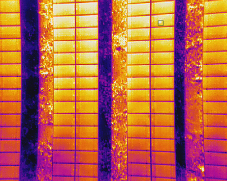
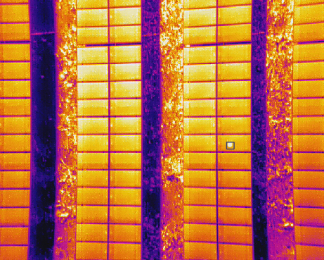
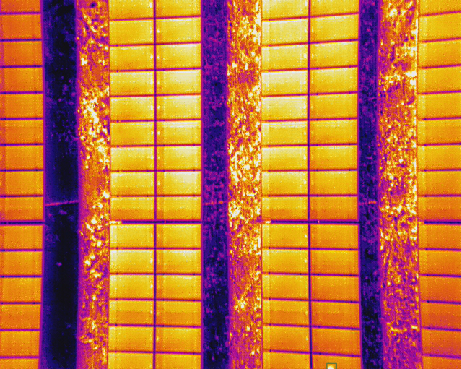
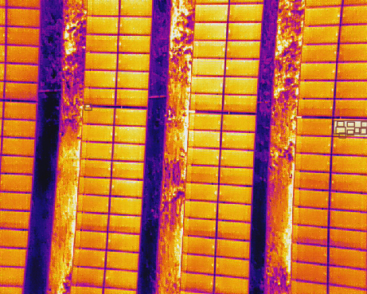

# Solar Hotspot Automatic analysis
A minimal PyTorch implementation of YOLOv3, to detech solar hotpots automatically and report its area, temperature of defects

## Installation
##### Clone and install requirements
Credit to Original Repo - https://github.com/eriklindernoren/PyTorch-YOLOv3

    $ git clone https://github.com/ManishSahu53/solarHotspotAnalysis.git
    $ cd solarHotspotAnalysis/
    $ sudo pip3 install -r requirements.txt

##### Download pretrained weights
    $ Check the Google Drive link in Issue page in Github
    
## Inference
Uses pretrained weights to make predictions on images. Below table displays the inference times when using as inputs images scaled to 256x256. The ResNet backbone measurements are taken from the YOLOv3 paper. The Darknet-53 measurement marked shows the inference time of this implementation on my 1080ti card.

    $ python detect.py --image_folder sample_data/test/RJPG --model_def config/yolov3-solar.cfg --weights_path weights/yolov3_ckpt_49.pth --class_path sample_data/classes.names

Sample output in JSON with temperature, BoundingBox and area of defect
```
    "data/solar/test/RJPG/DJI_0004_R.JPG": [
        {
            "class": "0.0",
            "class_confidence": "1.0",
            "bbox": [
                "446",
                "279",
                "458",
                "293"
            ],
            "stats": {
                "min": 34.1401879967774,
                "max": 46.0524921261304,
                "mean": 37.3142733195741,
                "median": 36.09978280042708,
                "area": 168
            }
        }
    ],
```

<p align="center"></p>
<p align="center"></p>
<p align="center"></p>
<p align="center"></p>

## Train
```
$ train.py [-h] [--epochs EPOCHS] [--batch_size BATCH_SIZE]
                [--gradient_accumulations GRADIENT_ACCUMULATIONS]
                [--model_def MODEL_DEF] [--data_config DATA_CONFIG]
                [--pretrained_weights PRETRAINED_WEIGHTS] [--n_cpu N_CPU]
                [--img_size IMG_SIZE]
                [--checkpoint_interval CHECKPOINT_INTERVAL]
                [--evaluation_interval EVALUATION_INTERVAL]
                [--compute_map COMPUTE_MAP]
                [--multiscale_training MULTISCALE_TRAINING]
```

#### Example (COCO)
To train on COCO using a Darknet-53 backend pretrained on ImageNet run: 
```
$ python3 train.py --data_config config/coco.data  --pretrained_weights weights/darknet53.conv.74
```

## Train on Custom Dataset

#### Custom model
Run the commands below to create a custom model definition, replacing `<num-classes>` with the number of classes in your dataset.

```
$ cd config/                                # Navigate to config dir
$ bash create_custom_model.sh <num-classes> # Will create custom model 'yolov3-custom.cfg'
```

#### Classes
Add class names to `data/custom/classes.names`. This file should have one row per class name.

#### Image Folder
Move the images of your dataset to `data/custom/images/`.

#### Annotation Folder
Move your annotations to `data/custom/labels/`. The dataloader expects that the annotation file corresponding to the image `data/custom/images/train.jpg` has the path `data/custom/labels/train.txt`. Each row in the annotation file should define one bounding box, using the syntax `label_idx x_center y_center width height`. The coordinates should be scaled `[0, 1]`, and the `label_idx` should be zero-indexed and correspond to the row number of the class name in `data/custom/classes.names`.

#### Define Train and Validation Sets
In `data/custom/train.txt` and `data/custom/valid.txt`, add paths to images that will be used as train and validation data respectively.

#### Train
To train on the custom dataset run:

```
$ python3 train.py --model_def config/yolov3-custom.cfg --data_config config/custom.data
```

Add `--pretrained_weights weights/darknet53.conv.74` to train using a backend pretrained on ImageNet.


## Credit

### YOLOv3: An Incremental Improvement
_Joseph Redmon, Ali Farhadi_ <br>
